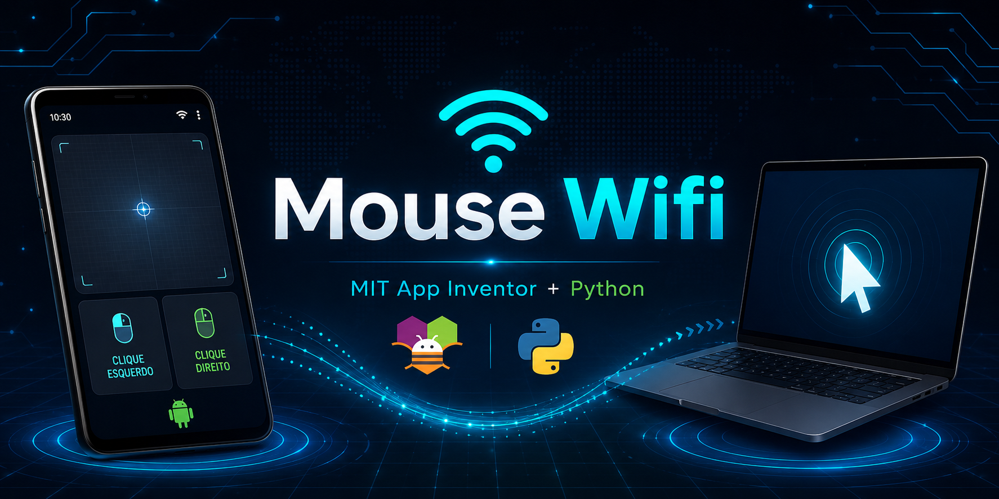
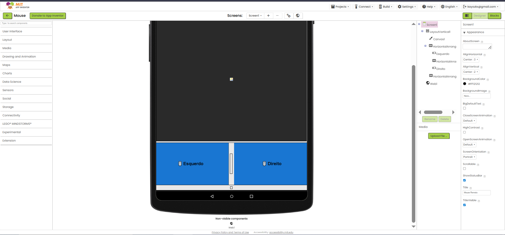
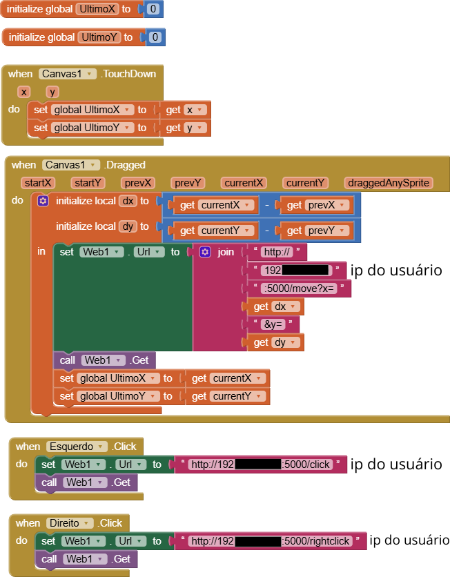

# 🖱️ Mouse Wifi — MIT App Inventor

## 📋 Índice

- [Sobre o Projeto](#-sobre-o-projeto)
- [Funcionalidades](#-funcionalidades)
- [Requisitos](#-requisitos)
- [Instalação](#-instalação)
- [Como Descobrir o IP](#-como-descobrir-o-ip)
- [Configuração no MIT App Inventor](#-configuração-no-mit-app-inventor)
- [Telas do App](#-telas-do-app)
- [Como Usar em Outro Computador](#-como-usar-em-outro-computador)
- [Estrutura do Projeto](#-estrutura-do-projeto)
- [Observações](#-observações)
- [Importar o Projeto](#-importar-o-projeto)
- [O que Aprendi](#-o-que-aprendi)
- [Autor](#️-autor)

---

## 📱 Sobre o Projeto

Mouse Wifi transforma um celular Android em um touchpad remoto para controlar o computador via rede Wi-Fi local. O celular se comunica com um servidor Python rodando no PC, enviando comandos de movimentação e clique em tempo real.

**Ferramenta:** MIT App Inventor
**Servidor:** Python com Flask e PyAutoGUI
**Conexão:** Wi-Fi local
**Plataforma:** Android + Windows

---

## ✅ Funcionalidades

- Movimentação do cursor pelo touchpad da tela
- Clique esquerdo
- Clique direito
- Controle via rede Wi-Fi local

---

## Requisitos

### No computador

* Python 3 instalado
* VS Code (opcional)
* Flask
* PyAutoGUI

### No celular

* Aplicativo criado no MIT App Inventor

## Instalação

### 1. Instalar dependências

Abra o terminal e execute:

pip install flask pyautogui

### 2. Executar o servidor

Na pasta onde está o arquivo mouse.py execute:

python mouse.py

Se tudo estiver correto aparecerá algo semelhante a:

Running on http://0.0.0.0:5000

## Descobrir o IP do computador

Abra o Prompt de Comando:

ipconfig

Procure por:

Endereço IPv4

Exemplo:

000.000.0.000

Esse endereço deverá ser utilizado no aplicativo MIT App Inventor.

## Configuração no MIT App Inventor

O componente Web deve utilizar URLs no formato:

Movimentação:

http://IP_DO_PC:5000/move?x=VALORX&y=VALORY

Clique esquerdo:

http://IP_DO_PC:5000/click

Clique direito:

http://IP_DO_PC:5000/rightclick

Substitua:

IP_DO_PC

pelo IPv4 encontrado com o comando:

ipconfig

Exemplo:

http://000.000.0.000:5000/click

## Estrutura do Projeto

MouseWifiMIT

├── mouse.py

└── README.md

## Como utilizar em outro computador

1. Baixe o arquivo mouse.py deste repositório.
2. Abra o VS Code.
3. Abra a pasta do projeto.
4. Execute:

python mouse.py

5. Descubra o IP com:

ipconfig - (no cmd)

6. Atualize o IP no aplicativo MIT App Inventor.
7. Conecte o celular e o computador na mesma rede Wi-Fi.
8. Utilize normalmente.

## Observações

* Computador e celular devem estar na mesma rede.
* Alguns firewalls podem bloquear a porta 5000.
* Caso o IP mude, atualize o endereço no aplicativo.
* O servidor deve permanecer aberto enquanto o aplicativo estiver sendo utilizado.

## 📦 Projeto MIT App Inventor

Caso prefira, baixe o arquivo `MouseWifiMIT.aia` e importe diretamente no MIT App Inventor em vez de recriar do zero:

Projects → Import project (.aia)

---

Projeto desenvolvido utilizando:

* MIT App Inventor
* Python
* Flask
* PyAutoGUI

>Desenvolvido dia 04 de junho de 2026.
